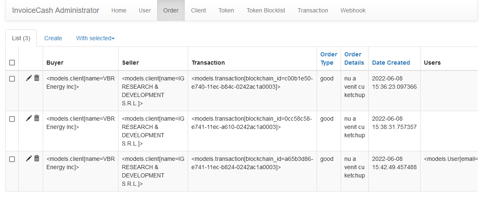

# Flask ReactJs Boilerplate Scalable

# Scalable Flask App with Security, RESTful, and SQLAlchemy
This boilerplate offers a quickstart for building a Python-Flask RESTful API, with built-in support for PostgreSQL, using SQLAlchemy as an ORM. It also makes use of Flask-Security in order to control Users and Roles, as well as Flask-Migrate, to manage database migrations.

## Overview

This project is a simple Dog-Owner tracker. The owners are considered Users, and we've set up Users, and roles (among other [things](https://pythonhosted.org/Flask-Security/features.html)) through ```Flask-Security```. The models (found in ```db > models.py```) are declared and managed using ```SQLAlchemy```. The ```Flask-Restful``` API can be seen throughout the project, though the ```dog.py``` and ```owner.py``` files in the ```resources``` directory will be of most use when figuring out how to set up the HTTP methods through class-based methods.

We're using ```Flask-JWT``` for authentication and authorization.

The configuration for ```Flask-migrate``` can be seen in the ```migrate.py``` file in the project root.

We make use of ```marshmallow``` and ```marshmallow_jsonapi``` for JSON and data validation. Schemas are declared for every model in the ```models.py``` file, and validation is performed in the different resource files.

# Features

- Add Poetry packages manager
- Dockerize project for dev
- Create models and migrations
- Create more api endpoints
- Implement Webhooks
- Implement Redis Queue Worker
- Add supervisor for fast startup and webhook worker
- Implement Factory Pattern
- Log webhooks
- Setup Flask-Mail queue 
- Add Login/Register Routes with jwt_extended (implement single token settings config)
- Add api endpoints documentation (<a href="/api/v1/docs">/docs</a>)
- Implement custom commands
- Add blockchain commands group
- Setup modex blockchain api config

### ToDo:

- create modex entities, and handle auth token
- implement modex blockchain webhooks

## Pip Packages Needed:

- flask
- flask-security
- flask-restful
- flask-cors
- flask-sqlalchemy
- flask-migrate
- flask-script
- flask-marshmallow 
- flask-jwt
- marshmallow
- marshmallow_jsonapi
- marshmallow-sqlalchemy
- typing-extensions
- psycopg2-binary
- rq
- redis
- gunicorn
- python-dotenv
- flask-rq2
- flasgger 

## Before Running Server - Set Up Database:

Create your DB in Postgres using the credentials stored in the ```config/base_settings.py``` file (see the ```setup.md``` file for instructions on doing this), and then run the following from the project root:

Join API docker container shell and execute:

```bash
python3 console.py db init (once)
python3 console.py db migrate (on every model change)
python3 console.py db upgrade (to execute migrations)
```

Add blockchain custom commands:

```
root@9928cf683f5b:/app# python3 console.py 
Usage: console.py [OPTIONS] COMMAND [ARGS]...

Options:
  --version  Show the flask version
  --help     Show this message and exit.

Commands:
  blockchain  Perform blockchain operations.
  db          Perform database migrations.
```

## ENDPOINTS
```
Endpoint                         Methods  Rule
-------------------------------  -------  -----------------------------------
flasgger.<lambda>                GET      /apidocs/index.html
flasgger.apidocs                 GET      /api/v1/docs/
flasgger.apispec_1               GET      /api/v1/docs/apispec_1.json
flasgger.static                  GET      /api/v1/docs/static/<path:filename>
v1.clientcreate                  POST     /api/v1/clients
v1.clientupdate                  PATCH    /api/v1/clients/<int:id>
v1.homepage                      GET      /api/v1/
v1.logoutuser                    POST     /api/v1/logout
v1.ordercreate                   POST     /api/v1/orders
v1.refreshtoken                  POST     /api/v1/token/refresh
v1.show                          POST     /api/v1/client-webhook-1
v1.transactionblockchainwebhook  POST     /api/v1/webhooks/transactions
v1.userlogin                     POST     /api/v1/login
```
## JSON Request Format 

## CLIENTS

### CREATE CLIENT
***POST REQUEST***
```
{
    "data": {
        "type": "client",
        "attributes": {
            "name": "FirmaMareCuMMar2e",
            "client_type": 1,
            "webhook_url": "https://41ae-213-233-108-217.ngrok.io/api/v1/webhook-client-1/",
            "webhook_key": "xuoksiud234"
        }
    }
}
```
### UPDATE CLIENT
***PATCH REQUEST***
```
{
    "data": {
        "type": "client",
        "attributes": {
            "webhook_url": "anulat",
            "webhook_key": "xuoksiud2343"
        }
    }
}
```
### CREATE ORDER
***POST REQUEST***
```
- buyer_id, seller_id - clients id

{
    "data": {
        "type": "order",
        "attributes": {
            "buyer_id": 2, 
            "order_type": "good",
            "seller_id": 1,
            "order_details": "nu a venit cu ketchup"
        }
    }
}

```

**Note**: If make sure the value for the "type" key matches the "type" value in the ```Meta``` class of whatever ```Schema``` used to validate your object. You also can input however many attributes for your object as you'd like in the "attributes" dictionary.

```
Authorization : Bearer AUTH_TOKEN
```

## Users - Setup

You'll notice that there are several lines of code under the "Bootstrap Several Users" section in ```main.py```. These users will be created if there are no users in the database, once you run the server, and hit an endpoint. I recommend using [Postman](https://www.getpostman.com/) to hit the endpoint ```localhost:5000/api/v1/orders``` to get these users started.

**Note:** Make sure that once you're aware of this code there and the users that they create if using this boilerplate for a production-level application!


## For Developers 

**Authentication**
As you can see in  the ```user.py``` file, all of the CRUD features for the ```User``` class are protected by the decorator ```jwt_required()```. This means that a valid Authorization token is needed in order to reach those endpoints and perform that logic. In order to get a valid auth token, send a POST request to this url: ```/api/v1/auth``` with the Content-Type Header of ```application/json```, passing in the following:

```
{
    "username": "EMAIL",
    "password": "PASSWORD"
}
```

Once you send that request, you should get the following back:

```
{
    "access_token": "AUTH_TOKEN"
}
```

Using this token, you can then call the protected endpoints by adding the following headers to your calls:


# FRONTEND

- Add ReactJs Typescript boilerplate (done)